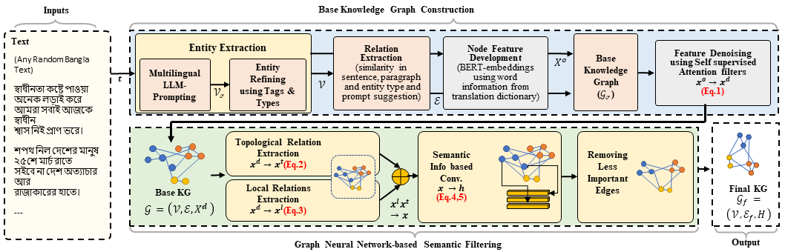
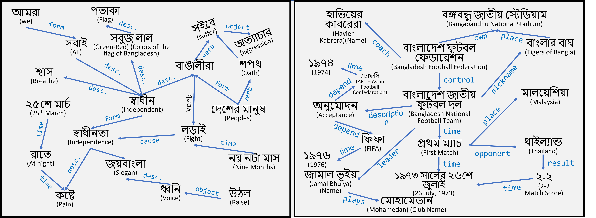
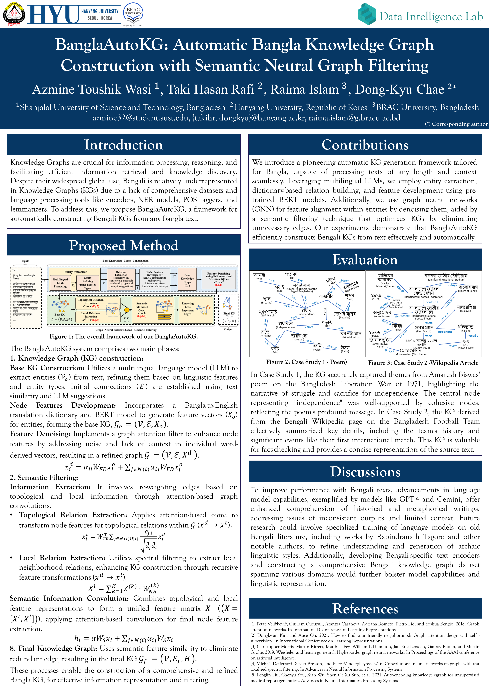

# ***BanglaAutoKG*: Automatic Bangla Knowledge Graph Construction with Semantic Neural Graph Filtering**
- **Authors:** Azmine Toushik Wasi, Taki Hasan Rafi,  Raima Islam and Dong-Kyu Chae
- **ACL Anthology**: https://aclanthology.org/2024.lrec-main.189/
- **arXiv**: https://arxiv.org/abs/2404.03528

---
**Abstract:** Knowledge Graphs (KGs) have proven essential in information processing and reasoning applications because they link related entities and give context-rich information, supporting efficient information retrieval and knowledge discovery; presenting information flow in a very effective manner. Despite being widely used globally, Bangla is relatively underrepresented in KGs due to a lack of comprehensive datasets, encoders, NER (named entity recognition) models, POS (part-of-speech) taggers, and lemmatizers, hindering efficient information processing and reasoning applications in the language. Addressing the KG scarcity in Bengali, we propose BanglaAutoKG, a pioneering framework that is able to automatically construct Bengali KGs from any Bangla text. We utilize multilingual LLMs to understand various languages and correlate entities and relations universally. By employing a translation dictionary to identify English equivalents and extracting word features from pre-trained BERT models, we construct the foundational KG. To reduce noise and align word embeddings with our goal, we employ graph-based polynomial filters. Lastly, we implement a GNN-based semantic filter, which elevates contextual understanding and trims unnecessary edges, culminating in the formation of the definitive KG. Empirical findings and case studies demonstrate the universal effectiveness of our model, capable of autonomously constructing semantically enriched KGs from any text.


## Architecture
 Pipeline of *BanglaAutoKG*.

<p align="center">
  
</p>

## Example Case Studies
Example uses of *BanglaAutoKG*.

<p align="center">
  
</p>

Texts are available in `.\case-studies\` folder.

---

## Citation
- **ACL** : 
```
Azmine Toushik Wasi, Taki Hasan Rafi, Raima Islam, and Dong-Kyu Chae. 2024. BanglaAutoKG: Automatic Bangla Knowledge Graph Construction with Semantic Neural Graph Filtering. In Proceedings of the 2024 Joint International Conference on Computational Linguistics, Language Resources and Evaluation (LREC-COLING 2024), pages 2100–2106, Torino, Italia. ELRA and ICCL.
```
- **BIBTEX** : 
```
@inproceedings{wasi-etal-2024-banglaautokg-automatic,
    title = "{B}angla{A}uto{KG}: Automatic {B}angla Knowledge Graph Construction with Semantic Neural Graph Filtering",
    author = "Wasi, Azmine Toushik  and Rafi, Taki Hasan  and Islam, Raima  and Chae, Dong-Kyu",
    booktitle = "Proceedings of the 2024 Joint International Conference on Computational Linguistics, Language Resources and Evaluation (LREC-COLING 2024)",
    month = may,
    year = "2024",
    address = "Torino, Italia",
    publisher = "ELRA and ICCL",
    url = "https://aclanthology.org/2024.lrec-main.189",
    pages = "2100--2106",
    code = "https://github.com/azminewasi/BanglaAutoKG",
}
```

---

# Poster
<p align="center">
  
</p>